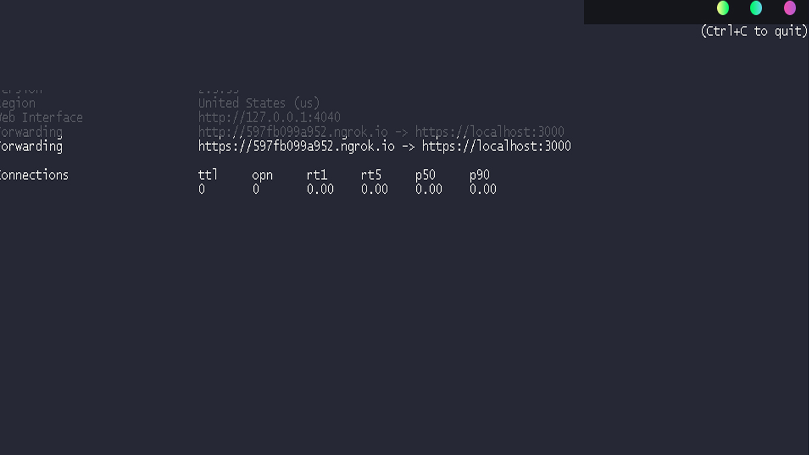

# How to set webhooks using express local server and NGROK

I've produced lots of telegram bots using polling method because I didn't know how to set webhooks from localhost. So, I took some time to learn how to do this and here I am to share it with you. 

# Setting things up

At first, you will need node js and npm installed to go ahead. Then, if you don't have it yet, download and install both. 

Besides them, you will need to use express, file system and https packages. So, to use HTTPS, you will need some extra stuff, like keys and certs. You can get these from CLI using this:

<pre>
# Our private cert will be key.pem, keep this file private
$ openssl genrsa -out key.pem 2048

# Our public certificate will be crt.pem
$ openssl req -new -sha256 -key key.pem -out crt.pem
</pre>

Save and keep them safe!

Now, you need to download Ngrok. It will provide a public URL that redirects requests from it to another URL.

<blockquote>
    Ngrok exposes local servers behind NATs and firewalls to the public internet over secure tunnels.
</blockquote>

Download it [here](https://ngrok.com/product).

# Getting hands dirty
At first, you will need to create an HTTPs server using express and https. 
<pre>
import https from 'https'
import express from 'express'
import fs from 'fs'
import 'env.ts'

const app = express();

const server = https.createServer({
    key: fs.readFileSync('path/to/server.key'),
    cert: fs.readFileSync('path/to/server.cert')
}, app);

</pre>

Your local server is almost ready and It's private. Then, as you need to turn it public, start ngrok, login and, then, use this:

<pre>
ngrok http https://localhost:3000
</pre>

The result will be something like it:

 You'll see the public URL that redirects to https://localhost:3000 on the left.

Now, you just need to set your telegrambot:
<pre>
const url = URL_PUBLIC_FROM_NGROK
const token = API_TELEGRAM_TOKEN

const options = {
        webHook: {
            port: 443
        }
    };
    
const bot = new TelegramBot(token, options);
bot.setWebHook(`${url}/bot${token}`);
</pre>

Everything is ready to go, but you need to set a route. This route will be how we get requests.

<code>
<pre>

const rthw = `/bot${YOUR TOKEN}`

app.post(rthw ,(req: Request, res: Response) =>{
        telegrambot.processUpdate(req.body);
        res.sendStatus(200);
});

--> Ngrok will redirect the request to your localhost and here we have this route to get it correctly.
</pre>
</code>

Now, let's put it on the road!
<code>
<pre>
 server.listen(3000, () => {
        console.log('Local server on!');
    })
</pre>
</code>

If everything is right, you will be able to see the request coming to your ngrok from ngrok cli and getting the status code 200.

